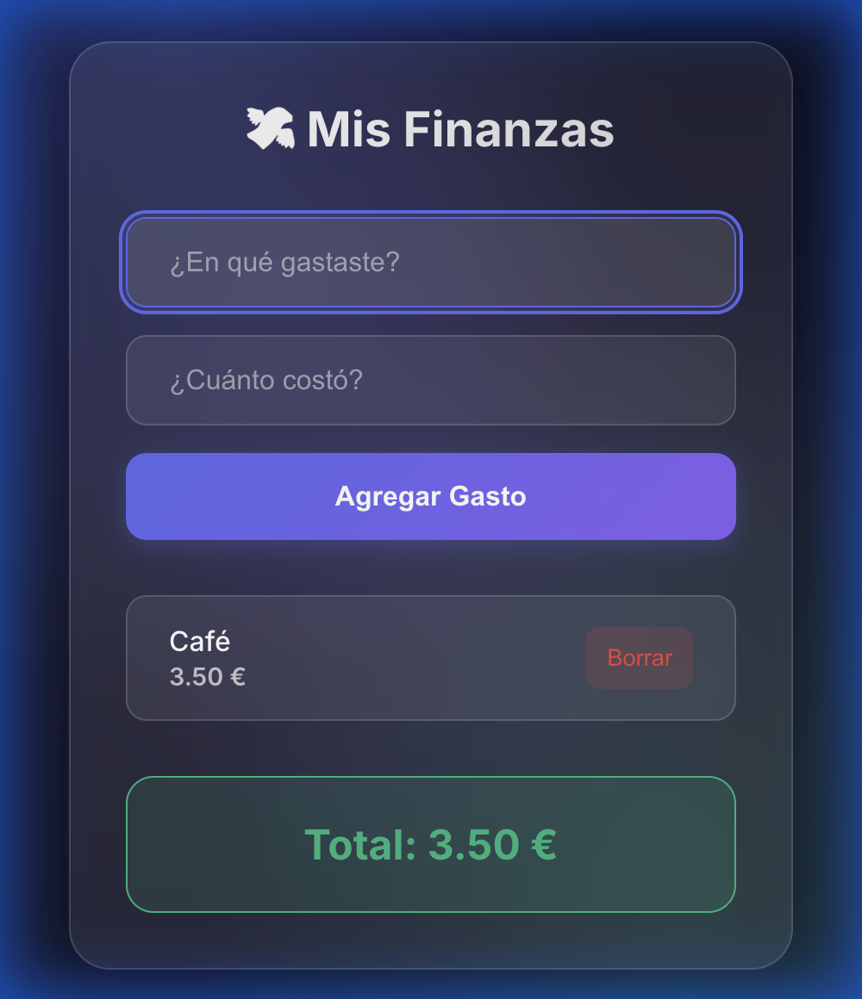

# 💸 Mis Finanzas | Glassmorphism UI

<div align="center">
  
  <br><br>

  [](https://freixanet.github.io/app-gastos-personal-basica/)
  
  <p>
    
    
    
    
  </p>
</div>

---

## 🚀 Overview

**Mis Finanzas** es una aplicación de gestión de gastos rediseñada con una estética moderna. 

El proyecto transforma una lista de tareas básica en una experiencia **Premium** utilizando **Glassmorphism**, animaciones fluidas y una arquitectura de código limpia y sin dependencias.

> "Diseño es inteligencia hecha visible."

## ✨ Key Features

- **💎 Glassmorphism UI**: Efecto cristal esmerilado (`backdrop-filter: blur`) con gradientes de fondo dinámicos.
- **📱 Mobile First**: Diseñado pensando primero en la experiencia móvil, escalando perfectamente a desktop.
- **🃏 Card Layout & Micro-interactions**: Elementos flotantes con sombras suaves y feedback visual al interactuar.
- **⚡ Zero Dependencies**: Construido con **Vanilla JavaScript** y CSS puro para máximo rendimiento (Lighthouse 100).
- **♿ Accessible Design**: Paleta de colores de alto contraste y soporte para navegación por teclado.

## 🛠️ Tech Stack

- **HTML5**: Estructura semántica (`<main>`, `<form>`, `<section>`).
- **CSS3 (Modern)**: 
  - `Custom Properties` (Variables) para el sistema de diseño.
  - `Flexbox` para layouts responsivos.
  - `Transitions` y `Keyframes` para animaciones.
- **JavaScript (ES6+)**:
  - `LocalStorage` para persistencia de datos.
  - DOM Manipulation eficiente.
  - Arrow functions y Clean Code.

## 📸 Preview

| Mobile View | Desktop View |
|-------------|--------------|
| Diseño compacto y accesible con botones grandes para facilitar la interacción táctil. | Diseño adaptativo para pantallas grandes. |

## 🔧 Installation

1. Clonar el repositorio:
   ```bash
   git clone git@github.com:Freixanet/app-gastos-personal-basica.git
   ```
2. Abrir `index.html` en tu navegador favorito.
3. ¡No requiere `npm install` ni build steps!

## 👨‍💻 Author

**Marc Freixanet** - *Frontend Developer*
* [GitHub Profile](https://github.com/Freixanet)

---
<div align="center">
  <sub>Built with ❤️ in Barcelona</sub>
</div>
